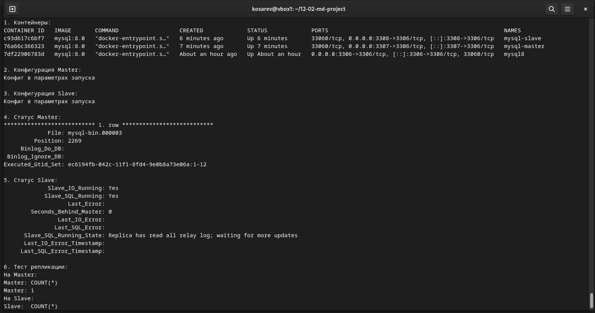

# Домашнее задание к занятию «Репликация и масштабирование. Часть 1»
**Косарев Д.О.**

## Задание 1

### Master-Slave:
- Один главный сервер (мастер) принимает все записи.
- Один или несколько подчинённых (слейвов) только читают и копируют данные с мастера.
- Если мастер упал — запись невозможна, пока его не поднимут или не назначат нового мастера.

### Master-Master:
- Два или более сервера являются мастерами и могут принимать записи.
- Они постоянно синхронизируют изменения между собой.
- Плюс: если один упал, запись идёт на других. Минус: могут быть конфликты данных, если одна запись пришла одновременно на два мастера.

## Задание 2

### Настройка Master-Slave репликации MySQL в Docker

*Рисунок 1: Результат настройки Master-Slave репликации*
